# DevChallenges

Resolved challenges in the site [DevChallenges](https://devchallenges.io/)

- [Responsive Web Developer](#responsive-web-developer)
- [JavaScript Developer](#javascript-developer)
- [Frontend Developer](#frontend-developer)

### Responsive Web Developer

#### [Challenge 01 - Minimal Blog Card](1_Responsive_Web_Developer/01_minimal_blog_card)

  <h4>
    <a href="https://dev-minimal-blog-card.netlify.app/">
      Demo
    </a>
     | 
    <a href="https://devchallenges.io/solution/8219">
      Solution
    </a>
     | 
    <a href="https://devchallenges.io/challenge/27">
      Challenge
    </a>
  </h4>

The challenge is to create a simple blog card that includes an image, a title, a short description, and a tag.

- HTML
- CSS
- Responsive Design

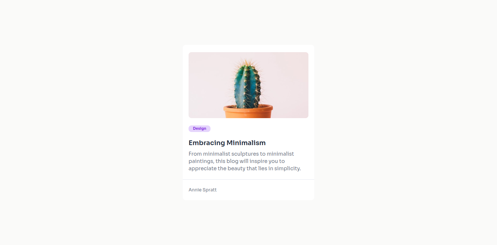

#### [Challenge 02 - Business Blog Card](1_Responsive_Web_Developer/02_business_blog_card)

  <h4>
    <a href="https://dev-business-blog-card.netlify.app/">
      Demo
    </a>
     | 
    <a href="https://devchallenges.io/solution/8366">
      Solution
    </a>
     | 
    <a href="https://devchallenges.io/challenge/28">
      Challenge
    </a>
  </h4>

The challenge is to create a business blog card that challenges you to use flexbox, positioning,

- HTML
- CSS
- Responsive Design

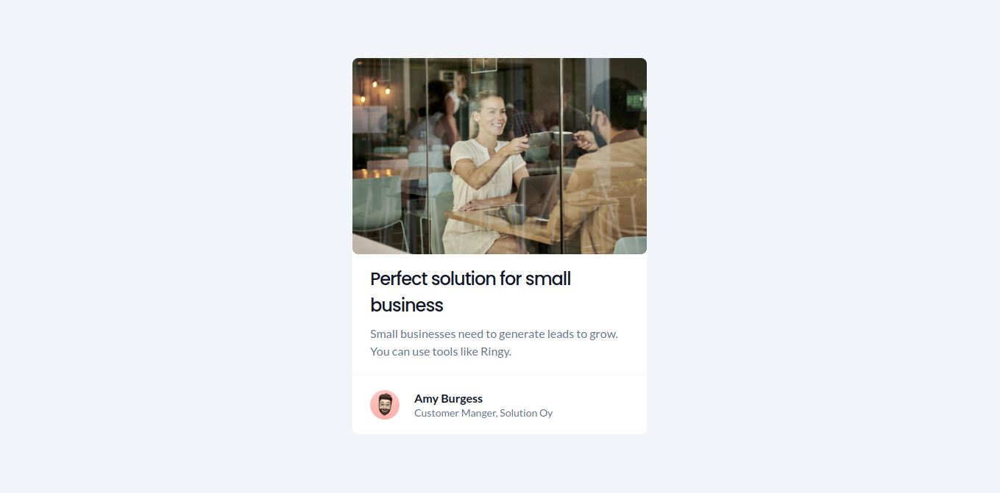

#### [Challenge 03 - Testimonial Page](1_Responsive_Web_Developer/03_testimonial_page)

  <h4>
    <a href="https://dev-testimonial-page.netlify.app/">
      Demo
    </a>
     | 
    <a href="https://devchallenges.io/solution/8469">
      Solution
    </a>
     | 
    <a href="https://devchallenges.io/challenge/29">
      Challenge
    </a>
  </h4>

The challenge is to create a simple testimonial page that you need use grid, media queries, icons.

- HTML
- CSS
- Responsive Design

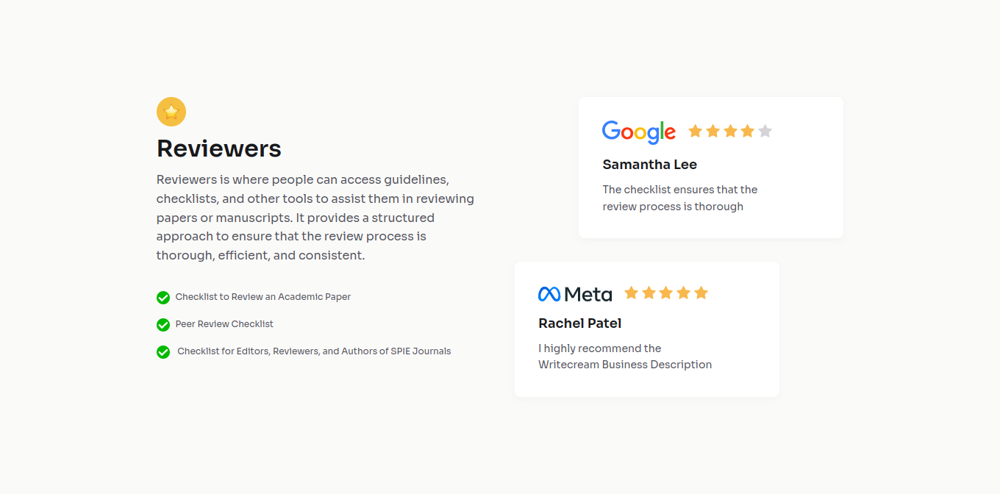

#### [Challenge 04 - Contact Page](1_Responsive_Web_Developer/04_contact_page)

  <h4>
    <a href="https://dev-contact-page.netlify.app/">
      Demo
    </a>
     | 
    <a href="https://devchallenges.io/solution/8557">
      Solution
    </a>
     | 
    <a href="https://devchallenges.io/challenge/31">
      Challenge
    </a>
  </h4>

The challenge is to create a contact page that you need to work with form, inputs.

- HTML
- CSS
- Saas
- Responsive Design

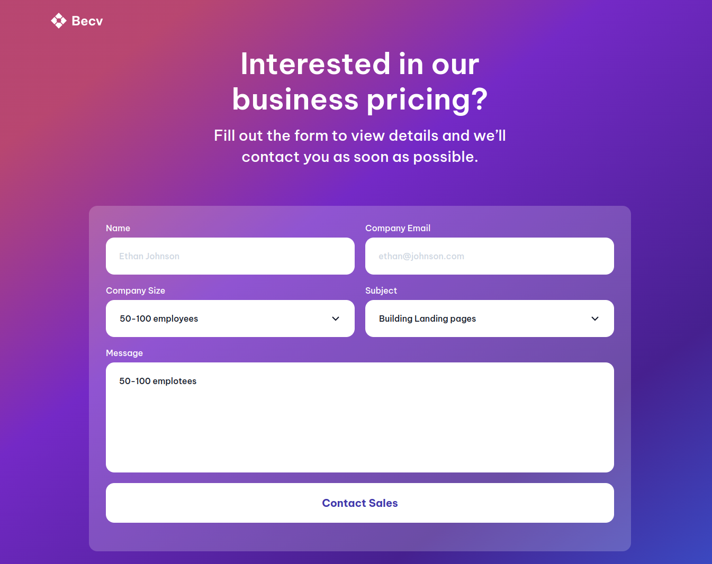

#### [Challenge 05- Simple Homepage](1_Responsive_Web_Developer/05_simple_homepage)

  <h4>
    <a href="https://dev-simple-homepage.netlify.app/">
      Demo
    </a>
     | 
    <a href="https://devchallenges.io/editor/solution/8590">
      Solution
    </a>
     | 
    <a href="https://devchallenges.io/challenge/33">
      Challenge
    </a>
  </h4>

The challenge is to create a FAQ page that challenges you to use JavaScript to modify basic elements.

- HTML
- CSS
- Saas
- JavaScript
- Responsive Design

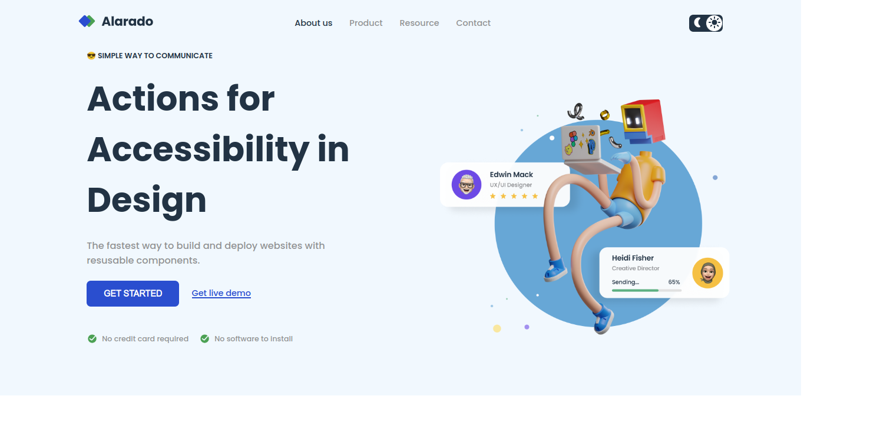

### JavaScript Developer

#### [Challenge 01 - Multi Step Form](2_JavaScript_Developer/01_minimal_blog_card)

  <h4>
    <a href="https://dev-multi-step-form.netlify.app/">
      Demo
    </a>
     | 
    <a href="https://devchallenges.io/editor/solution/8707">
      Solution
    </a>
     | 
    <a href="https://devchallenges.io/challenge/35">
      Challenge
    </a>
  </h4>

This challenge offers a great opportunity to enhance your JavaScript skills by creating a 3-step registration form with distinct sections.

- HTML
- CSS
- Saas
- JavaScript
- Responsive Design

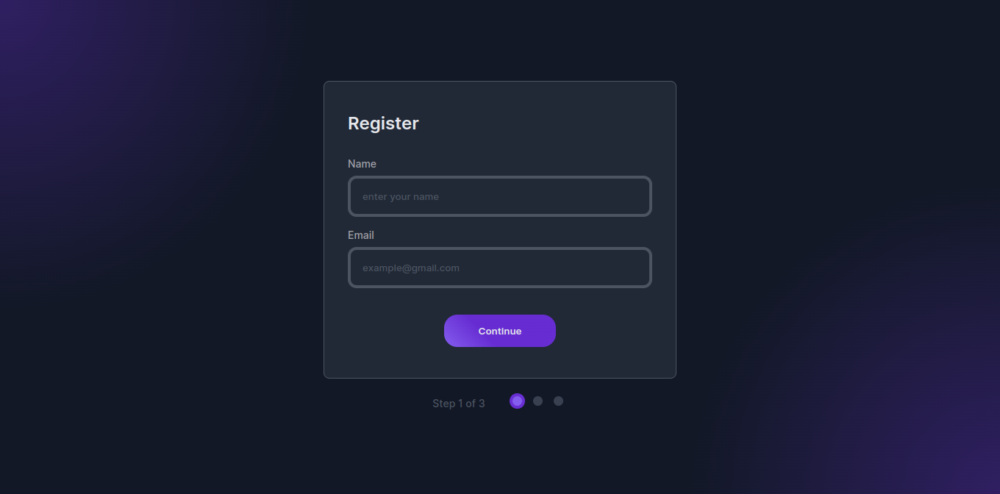

#### [Challenge 02 - Music Player](2_JavaScript_Developer/02_music_player)

  <h4>
    <a href="https://dev-music-player.netlify.app/">
      Demo
    </a>
     | 
    <a href="https://devchallenges.io/editor/solution/8913">
      Solution
    </a>
     | 
    <a href="https://devchallenges.io/challenge/36">
      Challenge
    </a>
  </h4>

Simple player player app that tests your data management capabilities using JavaScript

- HTML
- CSS
- Saas
- JavaScript
- Responsive Design

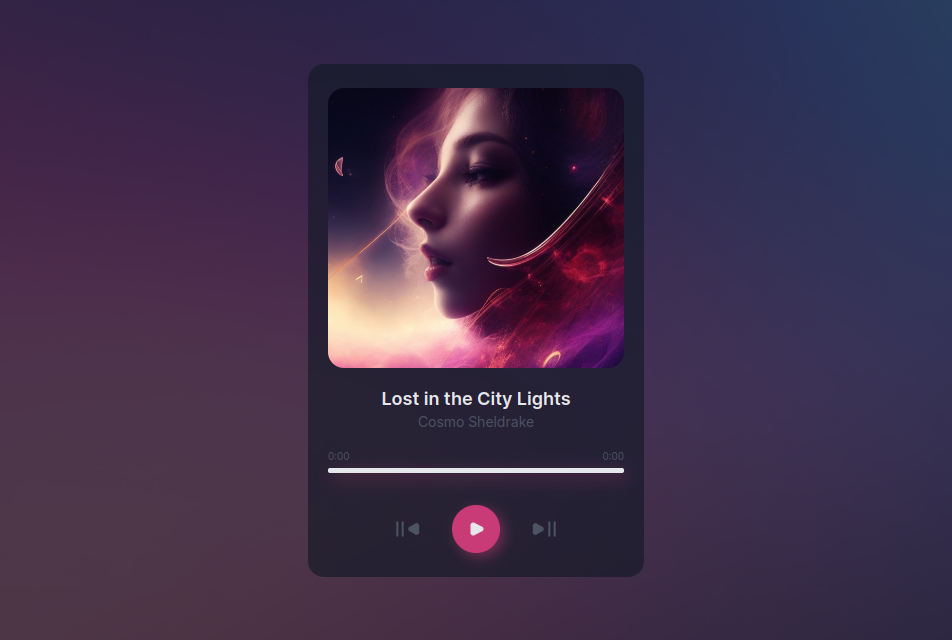

#### [Challenge 03 - Random Quote](2_JavaScript_Developer/03_random_quote)

  <h4>
    <a href="https://dev-random-quotee.netlify.app/">
      Demo
    </a>
     | 
    <a href="https://devchallenges.io/editor/solution/9044">
      Solution
    </a>
     | 
    <a href="https://devchallenges.io/challenge/38">
      Challenge
    </a>
  </h4>

This challenge involves creating a straightforward application for generating random quotes, which will necessitate the use of an external API

- HTML
- CSS
- Saas
- JavaScript
- API
- Responsive Design

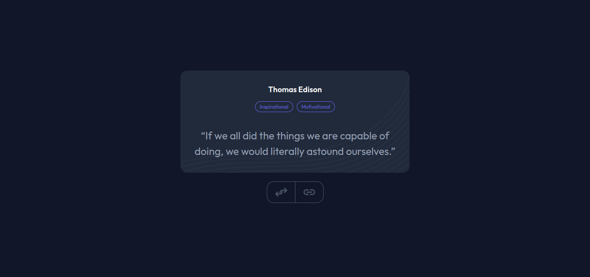

#### [Challenge 04 - Qr Code Generator](2_JavaScript_Developer/04_qrcode_generator)

  <h4>
    <a href="https://dev-qrcode-generator.netlify.app/">
      Demo
    </a>
     | 
    <a href="https://devchallenges.io/editor/solution/9157">
      Solution
    </a>
     | 
    <a href="https://devchallenges.io/challenge/41">
      Challenge
    </a>
  </h4>

This challenge provides an excellent opportunity to practice your JavaScript skills by creating a simple QR code generator application that requires the use of an external library.

- HTML
- CSS
- Saas
- JavaScript
- Library
- Responsive Design

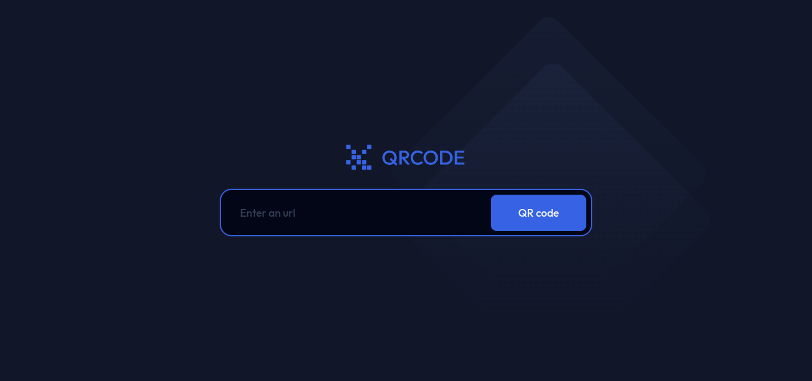

#### [Challenge 05 - Guess The Word Game](2_JavaScript_Developer/05_guess_word_game)

  <h4>
    <a href="https://dev-word-game.netlify.app/">
      Demo
    </a>
     | 
    <a href="#">
      Solution
    </a>
     | 
    <a href="https://devchallenges.io/challenge/37">
      Challenge
    </a>
  </h4>

This challenge is great to advance your JavaScript skills. The challenge is to create a small game that tests your data management and DOM manipulation with JavaScript.

- HTML
- CSS
- Saas
- JavaScript
- Responsive Design

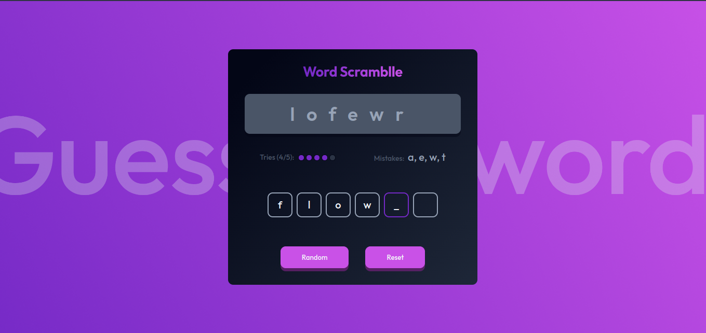

### Frontend Developer

#### [Challenge 01 - Simple Coffee Listing](3_Frontend_Developer/01_simple_coffee_listing)

  <h4>
    <a href="https://dev-coffee-listing.netlify.app/">
      Demo
    </a>
     | 
    <a href="#">
      Solution
    </a>
     | 
    <a href="https://devchallenges.io/challenge/45">
      Challenge
    </a>
  </h4>

The challenge was to develop a landing page with coffee products, with interactions for the user to select all products or just those that are evaluated. I used React.JS with TypeScript to solve this challenge.

- React
- TypeScript
- Styled Components
- Responsive Design

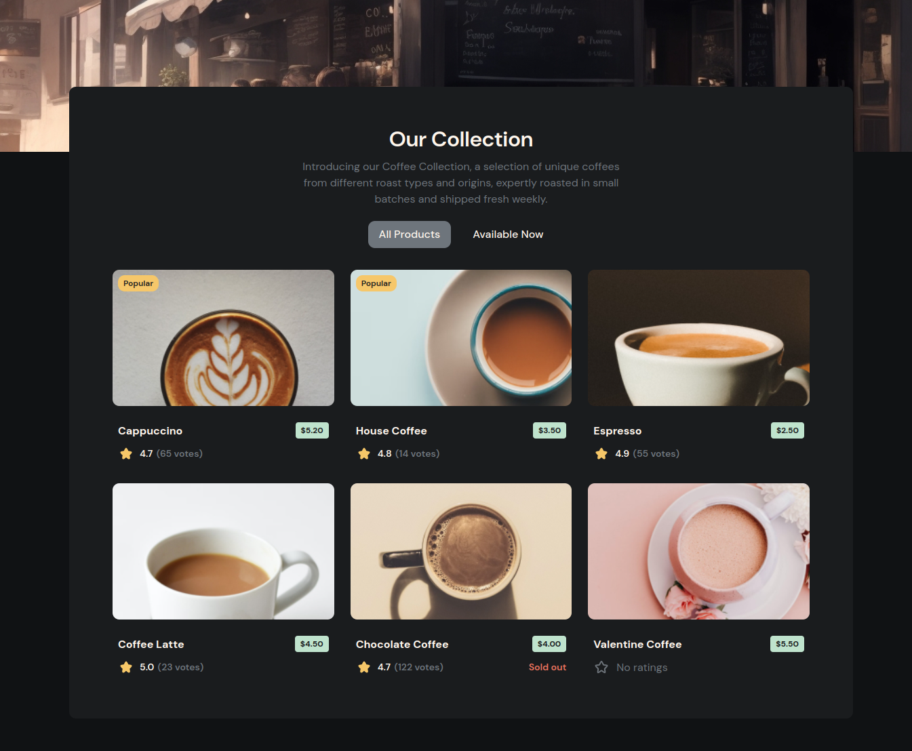
